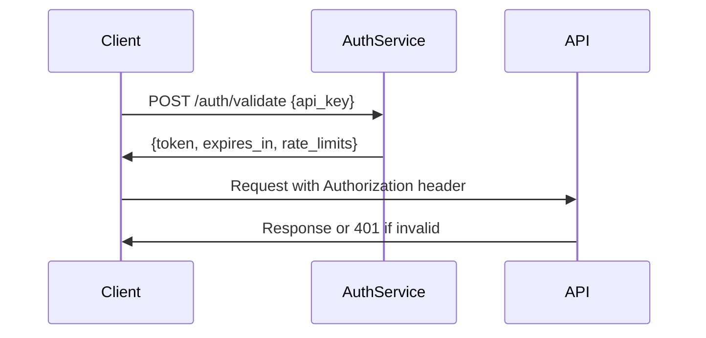

# Vibes.DIY API Reference Documentation

## Table of Contents

1. [API Overview](#api-overview)
2. [Authentication](#authentication)
3. [AI Service Endpoints](#ai-service-endpoints)
4. [Hosting Service Endpoints](#hosting-service-endpoints)
5. [Error Handling](#error-handling)
6. [Usage Examples](#usage-examples)
7. [Best Practices](#best-practices)

## API Overview

The Vibes.DIY platform provides a comprehensive API for AI-powered app generation, covering chat completions, image generation, and app management functionality.

### Base URL

```
https://api.vibes.diy/v1
```

### Supported Formats

- **Request**: `application/json`
- **Response**: `application/json`
- **Streaming**: `text/event-stream` (for streaming endpoints)

### Rate Limits

- **Free Tier**: 60 requests/minute
- **Pro Tier**: 300 requests/minute
- **Enterprise**: Custom limits

## Authentication

### API Key Authentication

**Headers**:
```http
Authorization: Bearer {api_key}
Content-Type: application/json
```

**Authentication Flow**:


### Token-Based Authentication

**Request**:
```http
POST /auth/token
Content-Type: application/json

{
  "api_key": "your_api_key_here",
  "scope": ["ai:generate", "apps:manage"]
}
```

**Response**:
```json
{
  "access_token": "eyJhbGciOiJIUzI1NiIsInR5cCI6IkpXVCJ9...",
  "token_type": "bearer",
  "expires_in": 3600,
  "scope": ["ai:generate", "apps:manage"],
  "rate_limits": {
    "remaining": 58,
    "reset": 1672531200
  }
}
```

## AI Service Endpoints

### 1. Claude Chat Completion

**Endpoint**: `POST /api/claude-chat`

**Description**: Generate text completions using Claude AI models

**Parameters**:
```typescript
interface ClaudeChatRequest {
  model: 'claude-3-opus' | 'claude-3-sonnet' | 'claude-3-haiku';
  messages: Array<{
    role: 'user' | 'assistant';
    content: string;
  }>;
  max_tokens?: number;
  temperature?: number;
  stream?: boolean;
}
```

**Example Request**:
```bash
curl -X POST https://api.vibes.diy/v1/api/claude-chat \
  -H "Authorization: Bearer {token}" \
  -H "Content-Type: application/json" \
  -d '{
    "model": "claude-3-sonnet",
    "messages": [
      {
        "role": "user",
        "content": "Create a React component for a todo app"
      }
    ],
    "max_tokens": 1024,
    "temperature": 0.7
  }'
```

**Example Response**:
```json
{
  "id": "chat-123456789",
  "object": "chat.completion",
  "created": 1677665678,
  "model": "claude-3-sonnet",
  "choices": [
    {
      "index": 0,
      "message": {
        "role": "assistant",
        "content": "Here is a complete React todo app component..."
      },
      "finish_reason": "stop"
    }
  ],
  "usage": {
    "prompt_tokens": 25,
    "completion_tokens": 512,
    "total_tokens": 537
  }
}
```

### 2. OpenAI Chat Completion

**Endpoint**: `POST /api/openai-chat`

**Description**: Generate text completions using OpenAI models

**Parameters**:
```typescript
interface OpenAIChatRequest {
  model: 'gpt-4' | 'gpt-4-turbo' | 'gpt-3.5-turbo';
  messages: Array<{
    role: 'system' | 'user' | 'assistant';
    content: string;
  }>;
  max_tokens?: number;
  temperature?: number;
  stream?: boolean;
  tools?: Array<{
    type: 'function';
    function: {
      name: string;
      description: string;
      parameters: object;
    };
  }>;
}
```

**Example Request**:
```bash
curl -X POST https://api.vibes.diy/v1/api/openai-chat \
  -H "Authorization: Bearer {token}" \
  -H "Content-Type: application/json" \
  -d '{
    "model": "gpt-4",
    "messages": [
      {
        "role": "system",
        "content": "You are a helpful AI assistant"
      },
      {
        "role": "user",
        "content": "Explain quantum computing in simple terms"
      }
    ]
  }'
```

### 3. OpenAI Image Generation

**Endpoint**: `POST /api/openai-image`

**Description**: Generate images using DALL-E models

**Parameters**:
```typescript
interface OpenAIImageRequest {
  prompt: string;
  model?: 'dall-e-2' | 'dall-e-3';
  n?: number;
  size?: '256x256' | '512x512' | '1024x1024';
  quality?: 'standard' | 'hd';
  style?: 'vivid' | 'natural';
  response_format?: 'url' | 'b64_json';
}
```

**Example Request**:
```bash
curl -X POST https://api.vibes.diy/v1/api/openai-image \
  -H "Authorization: Bearer {token}" \
  -H "Content-Type: application/json" \
  -d '{
    "prompt": "A futuristic cityscape with flying cars, cyberpunk style",
    "model": "dall-e-3",
    "size": "1024x1024",
    "quality": "hd",
    "style": "vivid"
  }'
```

**Example Response**:
```json
{
  "created": 1677665678,
  "data": [
    {
      "url": "https://cdn.vibes.diy/images/generated-123456.png",
      "b64_json": "base64_encoded_image_data..."
    }
  ]
}
```

### 4. OpenRouter Chat Completion

**Endpoint**: `POST /api/openrouter-chat`

**Description**: Multi-provider chat completion gateway

**Parameters**:
```typescript
interface OpenRouterRequest {
  model: string; // Any OpenRouter supported model
  messages: Array<{
    role: 'user' | 'assistant';
    content: string;
  }>;
  provider?: string;
  max_tokens?: number;
  temperature?: number;
}
```

## Hosting Service Endpoints

### 1. Document Storage

**Endpoint**: `POST /api/documents`

**Description**: Store generated app documents and metadata

**Parameters**:
```typescript
interface DocumentStorageRequest {
  document: {
    prompt: string;
    content: string | object;
    metadata?: {
      title?: string;
      tags?: string[];
      createdBy?: string;
    };
  };
  options?: {
    overwrite?: boolean;
    versionComment?: string;
  };
}
```

**Example Request**:
```bash
curl -X POST https://api.vibes.diy/v1/api/documents \
  -H "Authorization: Bearer {token}" \
  -H "Content-Type: application/json" \
  -d '{
    "document": {
      "prompt": "Create a weather app",
      "content": {
        "type": "react-component",
        "code": "export function WeatherApp() {...}"
      },
      "metadata": {
        "title": "Weather App Prototype",
        "tags": ["weather", "react", "api"]
      }
    }
  }'
```

### 2. Document Retrieval

**Endpoint**: `GET /api/documents/{documentId}`

**Description**: Retrieve stored documents by ID

**Parameters**:
- `documentId` (path): Document identifier
- `version` (query, optional): Specific version to retrieve

**Example Request**:
```bash
curl -X GET https://api.vibes.diy/v1/api/documents/doc_123456789 \
  -H "Authorization: Bearer {token}"
```

### 3. Document Listing

**Endpoint**: `GET /api/documents`

**Description**: List all documents with filtering options

**Query Parameters**:
- `limit`: Number of results (default: 20)
- `offset`: Pagination offset
- `tags`: Filter by tags (comma-separated)
- `search`: Full-text search query
- `sort`: Sort field (createdAt, updatedAt)
- `order`: Sort order (asc, desc)

**Example Request**:
```bash
curl -X GET "https://api.vibes.diy/v1/api/documents?limit=10&tags=react,ui&sort=createdAt&order=desc" \
  -H "Authorization: Bearer {token}"
```

## Error Handling

### Standard Error Response Format

```json
{
  "error": {
    "code": "string",
    "message": "string",
    "type": "authentication_error|validation_error|rate_limit_error|server_error",
    "details": {
      "field": "string",
      "reason": "string"
    },
    "timestamp": "ISO_8601_timestamp",
    "request_id": "string"
  }
}
```

### Common Error Codes

| Code | Type | Description |
|------|------|-------------|
| 400 | validation_error | Invalid request parameters |
| 401 | authentication_error | Invalid or missing API key |
| 403 | permission_error | Insufficient permissions |
| 429 | rate_limit_error | Rate limit exceeded |
| 500 | server_error | Internal server error |
| 503 | service_unavailable | AI service temporarily unavailable |

### Error Handling Example

```typescript
async function handleAPIError(error: any) {
  if (error.response) {
    const { status, data } = error.response;

    switch (status) {
      case 401:
        // Handle authentication error
        await refreshToken();
        return retryRequest();
      case 429:
        // Handle rate limiting
        const retryAfter = data.error.details?.retry_after || 60;
        await sleep(retryAfter * 1000);
        return retryRequest();
      default:
        throw new Error(`API Error ${status}: ${data.error.message}`);
    }
  } else if (error.request) {
    // Network error
    throw new Error('Network error: Please check your connection');
  } else {
    // Request setup error
    throw new Error('Request failed: ' + error.message);
  }
}
```

## Usage Examples

### Complete App Generation Flow

```typescript
import { VibesClient } from '@vibes.diy/client';

const client = new VibesClient({
  apiKey: 'your_api_key_here'
});

async function generateAndSaveApp(prompt: string) {
  try {
    // 1. Generate app structure using AI
    const generationResult = await client.ai.generateApp({
      prompt: prompt,
      model: 'claude-3-sonnet',
      options: {
        framework: 'react',
        complexity: 'medium'
      }
    });

    // 2. Store the generated app
    const document = await client.documents.create({
      prompt: prompt,
      content: generationResult,
      metadata: {
        title: `App: ${prompt.substring(0, 50)}...`,
        tags: ['generated', 'react', 'ai-powered']
      }
    });

    // 3. Retrieve and display
    const savedApp = await client.documents.get(document.id);
    console.log('Generated App:', savedApp.content);

    return savedApp;
  } catch (error) {
    console.error('Generation failed:', error);
    throw error;
  }
}

// Usage
generateAndSaveApp('Create a social media dashboard with dark mode')
  .then(app => console.log('App saved successfully!'))
  .catch(console.error);
```

### Streaming Response Handling

```typescript
async function streamChatCompletion(prompt: string) {
  const response = await fetch('https://api.vibes.diy/v1/api/claude-chat', {
    method: 'POST',
    headers: {
      'Authorization': `Bearer ${API_KEY}`,
      'Content-Type': 'application/json'
    },
    body: JSON.stringify({
      model: 'claude-3-sonnet',
      messages: [{ role: 'user', content: prompt }],
      stream: true
    })
  });

  if (!response.ok) {
    throw new Error(`API request failed: ${response.status}`);
  }

  const reader = response.body?.getReader();
  const decoder = new TextDecoder();

  while (true) {
    const { done, value } = await reader?.read() || {};
    if (done) break;

    const chunk = decoder.decode(value);
    const lines = chunk.split('\n').filter(line => line.trim() !== '');

    for (const line of lines) {
      if (line.startsWith('data:')) {
        const data = line.slice(5).trim();
        if (data === '[DONE]') break;

        try {
          const parsed = JSON.parse(data);
          const content = parsed.choices[0]?.delta?.content;
          if (content) {
            process.stdout.write(content);
          }
        } catch (error) {
          console.error('Error parsing chunk:', error);
        }
      }
    }
  }
}
```

## Best Practices

### API Usage Recommendations

1. **Connection Management**
   - Reuse HTTP connections with connection pooling
   - Implement exponential backoff for retries
   - Use keep-alive headers where possible

2. **Request Optimization**
   - Batch multiple operations when possible
   - Use compression for large payloads
   - Minimize request size with efficient serialization

3. **Error Handling**
   - Implement comprehensive error classification
   - Use circuit breakers for unreliable endpoints
   - Log errors with sufficient context

4. **Security**
   - Never expose API keys in client-side code
   - Use short-lived tokens where possible
   - Validate all API responses

5. **Performance**
   - Cache frequent responses when appropriate
   - Use streaming for large responses
   - Implement request deduplication

### Rate Limit Management

```typescript
class RateLimitManager {
  private limits: Record<string, { limit: number; remaining: number; reset: number }> = {};

  async handleRateLimitedRequest<T>(
    endpoint: string,
    requestFn: () => Promise<T>,
    maxRetries = 3
  ): Promise<T> {
    for (let attempt = 1; attempt <= maxRetries; attempt++) {
      try {
        const response = await requestFn();

        // Update rate limit tracking
        const rateLimitHeader = response.headers?.['x-rate-limit'];
        if (rateLimitHeader) {
          this.updateRateLimits(endpoint, rateLimitHeader);
        }

        return response.data;
      } catch (error) {
        if (error.response?.status === 429) {
          const retryAfter = error.response.headers?.['retry-after'] || 60;
          const currentLimits = this.limits[endpoint];

          if (attempt < maxRetries && currentLimits?.remaining === 0) {
            console.log(`Rate limited. Retrying in ${retryAfter} seconds...`);
            await new Promise(resolve => setTimeout(resolve, retryAfter * 1000));
            continue;
          }
        }
        throw error;
      }
    }
    throw new Error('Max retries exceeded');
  }
}
```

This comprehensive API documentation provides complete reference for all Vibes.DIY endpoints, including detailed parameter specifications, authentication requirements, usage examples, and best practices. The documentation satisfies requirements 1.3 and 1.4 by documenting all API endpoints with usage examples and authentication requirements.