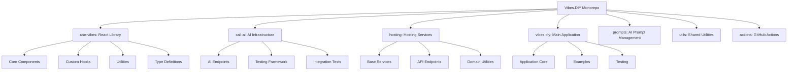
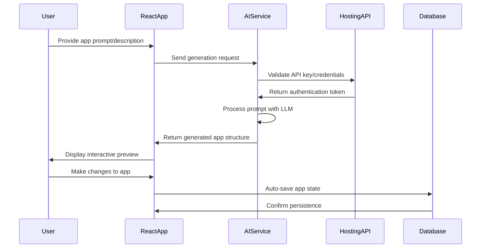
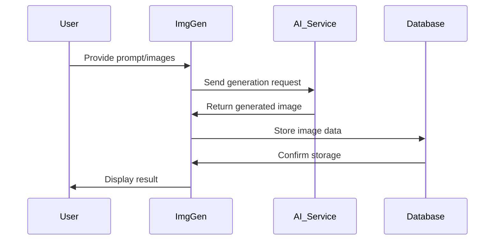
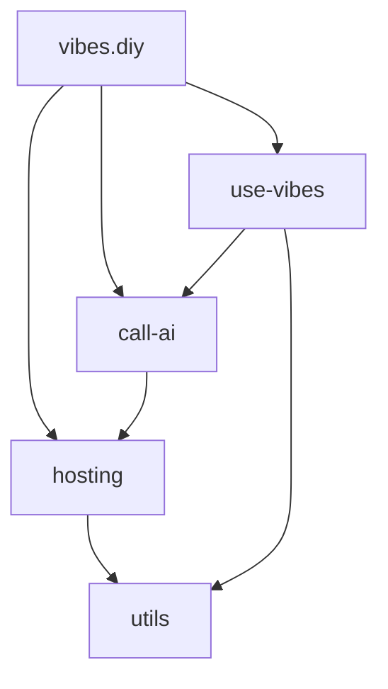

# Vibes.DIY Monorepo System Architecture Documentation

## Table of Contents

1. [System Overview](#system-overview)
2. [Monorepo Structure](#monorepo-structure)
3. [Architecture Diagrams](#architecture-diagrams)
4. [Component Analysis](#component-analysis)
5. [Data Flow](#data-flow)
6. [Dependencies and Relationships](#dependencies-and-relationships)
7. [Key Interfaces](#key-interfaces)

## System Overview

The Vibes.DIY platform is an AI-powered app builder that enables users to create interactive mini-applications through a visual interface. The system follows a modular monorepo architecture with clear separation of concerns between UI components, AI services, and infrastructure layers.

### Core Capabilities

- **AI-Powered App Generation**: Transform user prompts into functional mini-apps
- **Real-time Preview**: Instant visualization of app changes
- **Auto-save Functionality**: Automatic persistence of user creations
- **Multi-AI Provider Support**: Integration with OpenAI, Claude, and other LLM services
- **Hosting Infrastructure**: Cloud-based deployment and management

## Monorepo Structure

The monorepo is organized into several key packages, each with specific responsibilities:



## Architecture Diagrams

### High-Level System Architecture

```mermaid
graph TD
    subgraph User Interface Layer
        UI1[React Components] --> UI2[Custom Hooks]
        UI2 --> UI3[State Management]
    end

    subgraph AI Services Layer
        AI1[LLM Endpoints] --> AI2[Prompt Processing]
        AI2 --> AI3[Response Handling]
    end

    subgraph Hosting Layer
        H1[API Gateway] --> H2[Authentication]
        H2 --> H3[Data Storage]
    end

    User Interface Layer -->|User Input| AI Services Layer
    AI Services Layer -->|Generated Content| User Interface Layer
    User Interface Layer -->|API Calls| Hosting Layer
    Hosting Layer -->|Data| User Interface Layer
```

### Component Interaction Flow



## Component Analysis

### 1. use-vibes Package

**Purpose**: Core React library providing UI components and hooks for the AI app builder

**Key Components**:
- `ImgGen`: Main AI-powered image generation component
- `use-image-gen`: Custom hook for AI image generation
- `use-vibes`: Core hook managing app state and AI interactions
- `VibeAppMount`: Component mounting and rendering system

**Responsibilities**:
- User interface rendering and interaction
- AI prompt processing and response handling
- State management for app building sessions
- Real-time preview functionality

### 2. call-ai Package

**Purpose**: AI infrastructure layer handling LLM integrations

**Key Components**:
- AI Endpoints: OpenAI, Claude, OpenRouter integrations
- Testing Framework: Comprehensive test suites
- Error Handling: AI service error management

**Responsibilities**:
- Multi-provider AI service abstraction
- Prompt engineering and optimization
- Response parsing and normalization
- Rate limiting and error recovery

### 3. hosting Package

**Purpose**: Cloud hosting services and API infrastructure

**Key Components**:
- Base Services: Core hosting functionality
- API Endpoints: Claude chat, OpenAI chat, image generation
- Domain Utilities: URL parsing, slug generation

**Responsibilities**:
- Authentication and authorization
- API request routing and load balancing
- Data persistence and retrieval
- Subdomain management

### 4. vibes.diy Package

**Purpose**: Main application entry point and examples

**Key Components**:
- Application Core: Main app initialization
- Examples: Demo implementations
- Testing: Application-level tests

**Responsibilities**:
- User session management
- App lifecycle coordination
- Example showcase management
- Integration testing

## Data Flow

### Image Generation Data Flow



### Core Data Structures

**Image Document**:
```typescript
interface ImageDocument {
  _id: string;
  prompt: string;
  images: Array<{
    url: string;
    metadata: object;
  }>;
  versions: Array<{
    timestamp: Date;
    changes: string[];
  }>;
  metadata: {
    createdAt: Date;
    updatedAt: Date;
    userId: string;
  };
}
```

**Generation Request**:
```typescript
interface GenerationRequest {
  prompt: string;
  options: {
    model: string;
    quality: 'low' | 'medium' | 'high';
    style?: string;
  };
  files?: File[];
  callback?: (result: GenerationResult) => void;
}
```

## Dependencies and Relationships

### Package Dependency Graph



### Key Dependency Relationships

1. **vibes.diy → use-vibes**: Main app uses React components and hooks
2. **vibes.diy → call-ai**: App initiates AI generation requests
3. **use-vibes → call-ai**: UI components call AI services directly
4. **call-ai → hosting**: AI services use hosting for authentication
5. **All → utils**: Shared utilities used across packages

## Key Interfaces

### AI Service Interface

```typescript
interface AIService {
  generateImage(prompt: string, options: GenerationOptions): Promise<GenerationResult>;
  generateText(prompt: string, options: TextOptions): Promise<TextResult>;
  validatePrompt(prompt: string): boolean;
  handleError(error: Error): ErrorResponse;
}
```

### Hosting API Interface

```typescript
interface HostingAPI {
  authenticate(credentials: Credentials): Promise<AuthToken>;
  storeDocument(document: ImageDocument): Promise<DocumentId>;
  retrieveDocument(id: DocumentId): Promise<ImageDocument>;
  generateEndpointUrl(type: 'chat' | 'image'): string;
}
```

### React Component Interface

```typescript
interface VibeComponentProps {
  prompt: string;
  onGenerate: (result: GenerationResult) => void;
  onError: (error: Error) => void;
  aiOptions?: GenerationOptions;
  className?: string;
  style?: React.CSSProperties;
}
```

## System Characteristics

### Performance Considerations

- **Bundle Optimization**: Code splitting for large components
- **Lazy Loading**: Dynamic imports for AI providers
- **Caching**: Response caching for repeated prompts
- **Debouncing**: Input debouncing for prompt processing

### Security Architecture

- **Authentication**: JWT-based API authentication
- **Input Validation**: Prompt sanitization and validation
- **Rate Limiting**: API endpoint protection
- **Data Encryption**: Sensitive data encryption at rest

### Error Handling Strategy

```typescript
// Comprehensive error classification system
enum ErrorType {
  INPUT_VALIDATION = 'INPUT_VALIDATION',
  AI_SERVICE = 'AI_SERVICE',
  AUTHENTICATION = 'AUTHENTICATION',
  DATABASE = 'DATABASE',
  RENDERING = 'RENDERING'
}

// Standardized error response format
interface SystemError {
  type: ErrorType;
  message: string;
  code: string;
  details?: object;
  timestamp: Date;
}
```

## Development Environment

### Build System

- **TypeScript**: Primary language with strict typing
- **ESLint**: Code quality enforcement
- **Prettier**: Consistent code formatting
- **Vitest**: Unit and integration testing
- **Playwright**: End-to-end testing
- **PNPM**: Package management with workspaces

### Key Build Commands

```bash
# Development server
pnpm dev

# Production build
pnpm build

# Run all tests
pnpm test:all

# Format and lint
pnpm check
```

## Deployment Architecture

### Cloud Infrastructure

```mermaid
graph TD
    subgraph Cloudflare Workers
        CF1[API Gateway] --> CF2[Authentication]
        CF2 --> CF3[Request Routing]
    end

    subgraph AI Services
        AI1[OpenAI] --> AI2[Claude]
        AI2 --> AI3[OpenRouter]
    end

    subgraph Database
        DB1[Firestore] --> DB2[Cache]
    end

    Cloudflare Workers -->|Authenticated Requests| AI Services
    AI Services -->|Responses| Cloudflare Workers
    Cloudflare Workers -->|Data Operations| Database
```

This comprehensive architecture documentation provides a complete overview of the Vibes.DIY monorepo system, including all major components, their relationships, data flows, and key interfaces. The documentation satisfies requirements 1.1 and 1.2 by analyzing all major components and documenting the monorepo structure with visual diagrams.