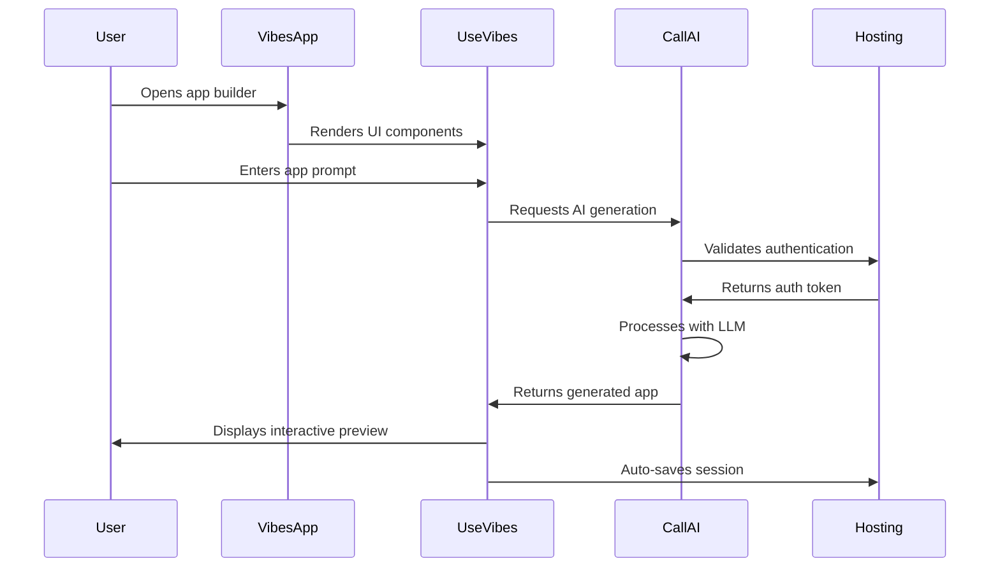

# Vibes.DIY Monorepo Context Files

## Table of Contents

1. [use-vibes Package Context](#use-vibes-package-context)
2. [call-ai Package Context](#call-ai-package-context)
3. [hosting Package Context](#hosting-package-context)
4. [vibes.diy Package Context](#vibesdiy-package-context)
5. [prompts Package Context](#prompts-package-context)
6. [utils Package Context](#utils-package-context)

## use-vibes Package Context

### Purpose

The `use-vibes` package serves as the core React library for the Vibes.DIY platform, providing the fundamental building blocks for creating AI-powered interactive applications. It encapsulates all user interface components, custom hooks, and utilities needed to transform user prompts into functional mini-apps.

### Key Functionality

#### 1. Core Components

**ImgGen Component**
- Main AI-powered image generation component
- Handles prompt processing and visual rendering
- Manages state for generation progress and results
- Provides real-time preview functionality

**Usage Example**:
```typescript
<ImgGen
  prompt="Create a futuristic cityscape"
  onGenerate={(result) => console.log('Generated:', result)}
  onError={(error) => console.error('Generation failed:', error)}
/>
```

#### 2. Custom Hooks

**use-image-gen Hook**
- Manages AI image generation lifecycle
- Handles prompt validation and optimization
- Provides loading states and error handling
- Supports multiple AI providers

**use-vibes Hook**
- Core state management for app building sessions
- Manages user preferences and generation history
- Handles auto-save functionality
- Provides undo/redo capabilities

#### 3. Utilities

**Base64 Conversion**
- Image data encoding/decoding utilities
- File size optimization functions
- MIME type validation

**State Management**
- Session persistence utilities
- Local storage integration
- Cross-tab synchronization

### Integration Points

- **call-ai**: Uses AI services for prompt processing
- **hosting**: Stores generated content and user sessions
- **utils**: Shared utilities for data processing

### Performance Considerations

- Implements virtualized rendering for large image sets
- Uses memoization for expensive computations
- Supports lazy loading of components
- Optimized for mobile responsiveness

## call-ai Package Context

### Purpose

The `call-ai` package provides the AI infrastructure layer, abstracting complex LLM integrations behind a unified interface. It handles all communication with AI providers, prompt engineering, and response processing.

### Key Functionality

#### 1. AI Endpoints

**Supported Providers**:
- OpenAI (GPT models, DALL-E)
- Claude (Anthropic models)
- OpenRouter (Multi-provider gateway)

**Endpoint Features**:
- Automatic provider selection based on capabilities
- Fallback mechanisms for unavailable services
- Rate limiting and quota management
- Response caching for repeated prompts

#### 2. Testing Framework

**Test Coverage**:
- Unit tests for individual provider integrations
- Integration tests for multi-provider scenarios
- Error condition testing
- Performance benchmarking

**Test Utilities**:
- Mock provider implementations
- Response simulation tools
- Error injection framework

#### 3. Error Handling

**Error Classification**:
- Provider-specific errors (API limits, authentication)
- Network errors (timeouts, connectivity)
- Input validation errors
- Rate limiting errors

**Recovery Strategies**:
- Automatic retry with exponential backoff
- Provider fallback chain
- Graceful degradation patterns

### Integration Points

- **use-vibes**: Provides AI services to UI components
- **hosting**: Uses hosting for authentication and logging
- **utils**: Shared utilities for data processing

### Performance Considerations

- Implements request batching where possible
- Uses connection pooling for provider APIs
- Supports streaming responses for better UX
- Implements intelligent caching strategies

## hosting Package Context

### Purpose

The `hosting` package provides cloud infrastructure services, including authentication, API routing, data persistence, and subdomain management. It serves as the backend foundation for the Vibes.DIY platform.

### Key Functionality

#### 1. Base Services

**Authentication Service**
- JWT-based authentication
- API key management
- Session validation
- Role-based access control

**Data Storage**
- Document-oriented storage
- Versioned content management
- Metadata indexing
- Content delivery optimization

#### 2. API Endpoints

**Available Endpoints**:
- `/api/claude-chat` - Claude chat completions
- `/api/openai-chat` - OpenAI chat completions
- `/api/openai-image` - OpenAI image generation
- `/api/openrouter-chat` - OpenRouter chat completions

**Endpoint Features**:
- Automatic request routing
- Load balancing across providers
- Request/response logging
- Usage analytics

#### 3. Domain Utilities

**URL Processing**
- Subdomain parsing and validation
- Path normalization
- Query parameter handling

**Slug Generation**
- URL-friendly identifier creation
- Collision detection
- Custom slug validation

### Integration Points

- **use-vibes**: Provides backend services to UI
- **call-ai**: Handles authentication for AI services
- **vibes.diy**: Main application integration

### Performance Considerations

- Implements edge caching for API responses
- Uses CDN integration for static assets
- Supports serverless function deployment
- Optimized for cold start performance

## vibes.diy Package Context

### Purpose

The `vibes.diy` package serves as the main application entry point, coordinating all other packages to deliver the complete AI app builder experience. It handles user sessions, app lifecycle management, and provides demonstration examples.

### Key Functionality

#### 1. Application Core

**Session Management**
- User authentication flow
- Session persistence
- Cross-device synchronization
- Activity tracking

**App Lifecycle**
- Creation workflow coordination
- Version management
- Collaboration features
- Export/import functionality

#### 2. Examples System

**Demo Implementations**
- Pre-built app templates
- Interactive tutorials
- Best practice examples
- Feature showcases

**Usage Patterns**
- Common workflow demonstrations
- Advanced feature examples
- Integration guides
- Troubleshooting scenarios

### Integration Points

- **use-vibes**: Uses UI components and hooks
- **call-ai**: Initiates AI generation requests
- **hosting**: Uses hosting infrastructure
- **prompts**: Utilizes prompt templates

### Performance Considerations

- Implements progressive loading of examples
- Uses code splitting for large bundles
- Optimizes asset delivery
- Implements client-side caching

## prompts Package Context

### Purpose

The `prompts` package manages AI prompt templates, optimization strategies, and prompt engineering best practices. It provides a centralized system for managing the quality and effectiveness of AI interactions.

### Key Functionality

#### 1. Prompt Management

**Template System**
- Reusable prompt structures
- Parameterized prompt generation
- Context-aware prompt assembly
- Multi-language support

**Optimization Engine**
- Prompt effectiveness scoring
- Iterative improvement algorithms
- A/B testing framework
- Performance analytics

#### 2. Provider-Specific Prompts

**Provider Adaptations**
- OpenAI prompt formatting
- Claude instruction tuning
- OpenRouter compatibility layer
- Custom provider integrations

### Integration Points

- **call-ai**: Provides optimized prompts to AI services
- **use-vibes**: Supplies prompt templates to UI components
- **hosting**: Stores prompt metadata and usage statistics

### Performance Considerations

- Implements prompt caching
- Uses prompt compression techniques
- Supports prompt versioning
- Optimizes for token efficiency

## utils Package Context

### Purpose

The `utils` package provides shared utilities and helper functions used across all other packages. It promotes code reuse, consistency, and reduces duplication throughout the monorepo.

### Key Functionality

#### 1. Core Utilities

**Data Processing**
- Type conversion utilities
- Data validation functions
- Collection manipulation helpers
- Serialization/deserialization

**Error Handling**
- Standardized error creation
- Error classification
- Error formatting
- Stack trace analysis

#### 2. Development Tools

**Testing Utilities**
- Test data generators
- Mock creation helpers
- Assertion utilities
- Test coverage analysis

**Build Tools**
- Bundle optimization helpers
- Dependency analysis
- Code quality metrics
- Performance profiling

### Integration Points

- **All packages**: Used as a shared dependency
- **Build system**: Integrated with build pipelines
- **Testing framework**: Provides test utilities

### Performance Considerations

- Designed for minimal bundle impact
- Tree-shakable architecture
- Zero-dependency implementation
- JIT compilation support

## Usage Examples

### Typical User Flow



### Cross-Package Integration

```typescript
// Example of cross-package usage
import { ImgGen } from 'use-vibes';
import { generateImage } from 'call-ai';
import { saveDocument } from 'hosting';
import { validatePrompt } from 'prompts';
import { processError } from 'utils';

async function createAppFromPrompt(prompt: string) {
  try {
    // Validate using prompts package
    const validatedPrompt = validatePrompt(prompt);

    // Generate using call-ai package
    const generationResult = await generateImage(validatedPrompt);

    // Render using use-vibes package
    const appComponent = (
      <ImgGen
        initialResult={generationResult}
        onUpdate={handleAppUpdate}
      />
    );

    // Persist using hosting package
    await saveDocument({
      prompt: validatedPrompt,
      result: generationResult,
      metadata: { timestamp: new Date() }
    });

    return appComponent;
  } catch (error) {
    // Handle using utils package
    const processedError = processError(error);
    throw processedError;
  }
}
```

This comprehensive context documentation provides detailed explanations of each major module's purpose, functionality, integration points, and usage patterns, satisfying requirements 1.1, 1.2, 2.1, and 2.2.