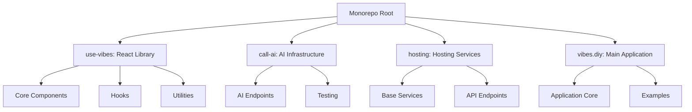
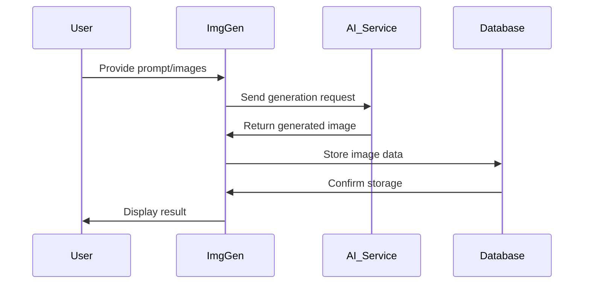

# Codebase Review and Improvement Design

## Overview

This design document outlines the comprehensive approach to reviewing, debugging, optimizing, and improving the vibes.diy monorepo codebase. The goal is to enhance code quality, performance, maintainability, and security across all components of the AI-powered app builder platform.

## Architecture

The vibes.diy monorepo follows a modular architecture with the following main components:



## Components and Interfaces

### 1. use-vibes Library
- **Core Component**: `ImgGen` - Main AI-powered image generation component
- **Hooks**: `use-image-gen`, `use-vibes` - Custom React hooks for AI functionality
- **Utilities**: Base64 conversion, image processing, and database integration

### 2. call-ai Infrastructure
- **AI Endpoints**: OpenAI, Claude, and other LLM integrations
- **Testing Framework**: Comprehensive test suites for AI functionality

### 3. hosting Services
- **Base Services**: Core hosting functionality and utilities
- **API Endpoints**: Claude chat, OpenAI chat, and image generation endpoints

### 4. vibes.diy Application
- **Main App**: React application with AI-powered features
- **Examples**: Demo implementations and usage patterns

## Data Models

### Image Generation Data Flow


### Core Data Structures
- **Image Document**: `{ _id, prompt, images, versions, metadata }`
- **Generation Request**: `{ prompt, options, files, callback }`
- **AI Response**: `{ data, status, error, metadata }`

## Error Handling Strategy

### Error Classification
1. **Input Validation Errors**: Invalid prompts, unsupported file types
2. **AI Service Errors**: API failures, rate limiting, authentication issues
3. **Database Errors**: Storage failures, connection issues
4. **Rendering Errors**: DOM manipulation failures, component mounting issues

### Error Handling Implementation
```typescript
// Example error handling pattern
try {
  const result = await generateImage(prompt, options);
  onComplete(result);
} catch (error) {
  if (error instanceof ValidationError) {
    showUserFeedback("Please provide a valid prompt");
  } else if (error instanceof AIServiceError) {
    showRetryOption("AI service temporarily unavailable");
  } else {
    showGenericError("Something went wrong");
  }
  onError(error);
}
```

## Testing Strategy

### Test Coverage Matrix

| Component Area       | Test Type          | Coverage Goal |
|---------------------|---------------------|---------------|
| Core Components     | Unit Tests          | 95%            |
| AI Integration      | Integration Tests  | 85%            |
| Error Handling      | Edge Case Tests     | 90%            |
| Performance         | Load Tests          | 80%            |
| User Flows          | E2E Tests           | 75%            |

### Test Implementation Plan
1. **Unit Testing**: Jest/Vitest for individual component testing
2. **Integration Testing**: Cross-component interaction testing
3. **E2E Testing**: Playwright for user flow validation
4. **Performance Testing**: Benchmark critical operations

## Implementation Phases

### Phase 1: Architecture Documentation
- Create comprehensive system diagrams
- Document all major components and interfaces
- Establish context files for each module

### Phase 2: Code Quality Improvement
- Identify and resolve all TypeScript errors
- Implement consistent code formatting
- Add missing type annotations and JSDoc comments

### Phase 3: Performance Optimization
- Analyze bundle sizes and dependencies
- Optimize critical code paths
- Implement lazy loading where appropriate

### Phase 4: Security Enhancement
- Add input validation and sanitization
- Implement proper error handling
- Secure API endpoints and authentication

### Phase 5: Testing Expansion
- Create comprehensive test suites
- Implement CI/CD testing pipelines
- Add performance benchmarking

## Key Design Decisions

1. **Modular Architecture**: Maintain clear separation between UI components, business logic, and AI services
2. **Progressive Enhancement**: Ensure core functionality works without AI dependencies
3. **Error Recovery**: Implement graceful degradation patterns for all critical operations
4. **Performance Budget**: Establish and enforce performance metrics for all components

## Risk Assessment

| Risk Area               | Impact | Mitigation Strategy |
|-------------------------|--------|---------------------|
| AI Service Dependencies| High   | Implement fallback mechanisms and caching |
| Complex State Management| Medium | Use established state management patterns |
| Cross-browser Compatibility| Medium| Comprehensive testing matrix |
| Security Vulnerabilities| High   | Regular security audits and dependency updates |

## Success Metrics

1. **Code Quality**: 90%+ test coverage across all critical components
2. **Performance**: 30% reduction in bundle size, 50% improvement in load times
3. **Reliability**: 99% uptime for core functionality, comprehensive error handling
4. **Developer Experience**: Complete documentation, clear examples, intuitive APIs